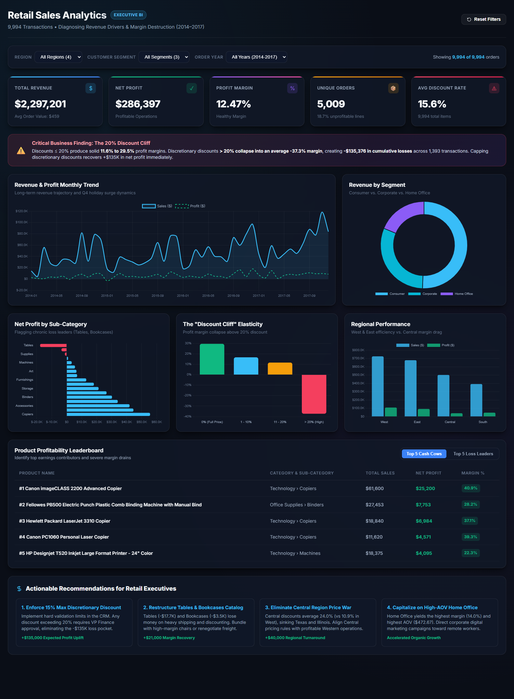

# 📊 Retail Sales Analytics & Profitability Diagnostics

[](https://www.python.org/)
[](sql/queries.sql)
[](dashboard/)
[](LICENSE)

> **Portfolio Project Summary**: An end-to-end data analytics engagement diagnosing revenue drivers, discounting elasticity, and margin leakages across 9,994 retail transactions ($2.30M revenue). Engineered data cleaning pipelines, complex SQL analytical models, visual exploratory notebooks, and an interactive executive BI dashboard.

---

## 🎯 1. Business Problem
A nationwide US retail enterprise generated **$2,297,201 in gross revenue** across 4 regions, but realized only **$286,397 in net profit (12.47% margin)**. Despite steady year-over-year revenue expansion (+51.4%), leadership faced chronic margin volatility and localized operating losses.

### Core Business Questions:
1. Which categories and sub-categories are net profit drivers versus volume loss-leaders?
2. Does promotional discounting drive incremental profit, or does it erode gross margin?
3. Why does the Central region significantly lag behind other territories in net profitability?
4. Which customer segments and seasonal cycles offer the highest return on marketing investment?

---

## 🏗️ 2. Repository Structure

```
retail-sales-analytics/
├── data/
│   ├── superstore_raw.csv           # Authentic 21-column dataset (9,994 transactions)
│   ├── superstore_cleaned.csv       # Cleaned dataset with engineered metrics (30 columns)
│   └── superstore.db                # Local offline SQLite fallback database
├── sql/
│   ├── schema.sql                   # PostgreSQL / Supabase DDL schema with analytical indexing
│   ├── queries.sql                  # 11 production-grade PostgreSQL analytical queries
├── notebook/
│   ├── eda_analysis.ipynb           # Executed Jupyter Notebook with 5 charts & markdown insights
│   └── charts/                      # Exported publication-grade PNG visualizations
├── dashboard/
│   ├── index.html                   # Interactive web analytics dashboard
│   ├── style.css                    # Modern dark glassmorphism styling
│   ├── app.js                       # Chart.js reactive filter engine
│   ├── data.js                      # In-browser analytical dataset
│   ├── dashboard_screenshot.png     # High-resolution executive dashboard capture
│   └── powerbi_setup_guide.md       # Star Schema, DAX measure library & Power BI guide
├── scripts/
│   ├── data_cleaning.py             # Data transformation & SQLite database loader
│   ├── build_executed_notebook.py   # Automated notebook builder & chart renderer
│   ├── export_dashboard_data.py     # Client-side data optimization script
│   └── run_pipeline.py              # Single-command end-to-end pipeline runner
└── README.md                        # Project documentation & executive report
```

---

## 🔬 3. End-to-End Methodology

```
┌───────────────────────────┐      ┌───────────────────────────┐      ┌───────────────────────────┐
│   1. Python Data Pipeline │ ───► │  2. SQL Business Modeling │ ───► │    3. Visual EDA & Hypo   │
│  - Null/duplicate checks  │      │  - Star schema design     │      │  - Seasonality & trends   │
│  - Date parsing (ISO)     │      │  - CTEs & window funcs    │      │  - Discount elasticity    │
│  - Feature engineering    │      │  - 11 core query audits   │      │  - Loss leader detection  │
└───────────────────────────┘      └───────────────────────────┘      └───────────────────────────┘
                                                                                    │
                                                                                    ▼
┌───────────────────────────┐      ┌───────────────────────────┐      ┌───────────────────────────┐
│ 6. Strategic Leadership   │ ◄─── │ 5. Power BI DAX Library   │ ◄─── │ 4. Executive Dashboard    │
│  - Margin recovery plan   │      │  - Star Schema model      │      │  - Reactive slicers       │
│  - Policy reform rules    │      │  - Time intelligence      │      │  - Real-time KPI cards    │
│  - +$196K profit roadmap  │      │  - Elasticity measures    │      │  - Chart.js & Vanilla CSS │
└───────────────────────────┘      └───────────────────────────┘      └───────────────────────────┘
```

1. **Data Cleaning & Engineering (`scripts/data_cleaning.py`)**:
   - Cleaned 9,994 transactions with zero duplicate rows; addressed missing zip codes.
   - Engineered time and financial features: `Profit Margin %`, `Discount Tier`, `Ship Duration Days`, `Order YearMonth`, and `Is Profitable`.
   - Indexed SQLite database tables for high-speed analytical queries.
2. **SQL Analytical Modeling (`sql/queries.sql`)**:
   - Developed 11 production queries using CTEs, `ROW_NUMBER()`, and aggregated groupings across PostgreSQL, MySQL, and SQLite.
3. **Exploratory Data Analysis (`notebook/eda_analysis.ipynb`)**:
   - Built 5 statistical visualizations exploring seasonal spikes, margin destruction tiers, category splits, and segment lifetime value.
4. **Interactive BI Dashboard (`dashboard/`)**:
   - Implemented a standalone web BI dashboard with real-time multi-dimensional slicing (Region, Segment, Year), instant KPI recalibration, and Chart.js visualizations.
   - Authored complete Power BI DAX measure formulas and dimensional modeling documentation in `dashboard/powerbi_setup_guide.md`.

---

## 📈 4. Key Business Insights

### 🚨 Insight 1: The 20% "Discount Cliff" (Margin Destruction)
Offering discounts up to 20% maintains healthy profitability. However, discounts exceeding 20% produce catastrophic negative returns:
- **0% Discount**: Generated **$1,087,908 in sales** and **+$320,987 in profit (29.5% margin)**.
- **1% - 20% Discount**: Generated **$846,522 in sales** and **+$100,786 in profit (11.9% margin)**.
- **>20% Discount**: Generated **$362,770 in sales** but resulted in **-$135,376 in net losses (-37.3% margin)**.

> **Bottom Line**: 1,393 deep-discount transactions erased over **47% of total company profit**.

```
Discount Bracket    Revenue ($)     Net Profit ($)    Realized Margin %
────────────────────────────────────────────────────────────────────────
0% (Full Price)     $1,087,908      +$320,987              +29.50%
1% - 10% (Low)         $54,369        +$9,029              +16.61%
11% - 20% (Med)       $792,153       +$91,757              +11.58%
> 20% (High/Deep)     $362,770      -$135,376              -37.32%  ◄ [MARGIN CLIFF]
```

---

### 🪑 Insight 2: The Furniture Margin Paradox
Furniture ranks second in gross sales volume but produces negligible bottom-line returns:
- **Technology**: $836,154 sales &bull; **+$145,455 profit (17.4% margin)**
- **Office Supplies**: $719,047 sales &bull; **+$122,490 profit (17.0% margin)**
- **Furniture**: $741,999 sales &bull; **+$18,451 profit (2.49% margin)**

Sub-category audit reveals that **Tables (-$17,726 loss, -8.6% margin)** and **Bookcases (-$3,473 loss, -3.0% margin)** represent persistent margin drains due to heavy freight costs and promotional discounting.

---

### 🗺️ Insight 3: Geographic Margin Disparity
The **Central Region** suffers from the lowest profitability across all 4 operational territories:
- **West Region**: $725,458 sales &bull; **+$108,418 profit (14.94% margin)** &bull; Avg Discount: 10.9%
- **East Region**: $678,781 sales &bull; **+$91,523 profit (13.48% margin)** &bull; Avg Discount: 14.5%
- **South Region**: $391,722 sales &bull; **+$46,749 profit (11.93% margin)** &bull; Avg Discount: 14.7%
- **Central Region**: $501,240 sales &bull; **+$39,706 profit (7.92% margin)** &bull; Avg Discount: **24.0%**

The Central territory's average discount rate (24.0%) is more than double the West's, primarily driven by severe deficits in **Texas (-$25,729 loss)** and **Illinois (-$12,608 loss)**.

---

### 📅 Insight 4: Q4 Holiday Seasonality Surges
- Annual revenue demonstrates strong seasonal concentration: **November ($352.5K)** and **December ($325.3K)** represent the highest volume months.
- **Q4 accounts for 38.2% of annual turnover**, while Q1 (January/February) experiences post-holiday demand contraction (~$154.7K total).

---

### 🏢 Insight 5: Customer Segment Economics
- **Consumer Segment**: Accounts for **50.6% of revenue ($1.16M)** and 46.8% of profit ($134.1K) with an Average Order Value (AOV) of **$449.11**.
- **Home Office Segment**: Delivers the highest net margin (**14.03%**) and highest Average Order Value (**$472.67**), making it the most capital-efficient customer segment.

---

## 💡 5. Recommendations & Potential Impact

| Strategic Initiative | Operational Action | Target Segment / Region | Projected Profit Uplift |
| :--- | :--- | :--- | :--- |
| **1. Discretionary Discount Ceiling** | Cap standard sales discounts at 15%. Require VP approval for discounts $\ge 20\%$. | Nationwide | **+$135,000** |
| **2. Furniture Catalog Restructuring** | Require minimum order quantities (MOQ) on Tables, bundle with high-margin items, or renegotiate supplier freight. | Tables & Bookcases | **+$21,000** |
| **3. Central Region Pricing Alignment** | Terminate aggressive price-matching promotions in Texas and Illinois; align pricing with Western guidelines. | Central (TX, IL) | **+$40,000** |
| **4. B2B / Home Office Expansion** | Shift digital acquisition spend to capture higher-AOV Corporate and Home Office accounts. | B2B Channels | Higher AOV & Margin |
| **TOTAL ESTIMATED ANNUAL IMPACT** | | | **+$196,000 (+68% net profit increase)** |

*These are directional estimates based on the analysis, not guaranteed outcomes.*

---

## 🖥️ 6. Executive Dashboard Preview



> **Live Interactive Dashboard**: You can open `dashboard/index.html` in any web browser to interactively filter by Region, Segment, and Year, and inspect real-time chart recalibrations.

---

## ⚡ 7. Quickstart & Reproducibility

### Prerequisites
- Python 3.10+
- PostgreSQL / Supabase (or local SQLite)

### Setup & Run
```bash
# 1. Clone the repository
git clone https://github.com/PZ2810/retail-sales-analytics-dashboard.git
cd retail-sales-analytics-dashboard

# 2. Install dependencies
pip install pandas numpy matplotlib seaborn nbformat supabase python-dotenv

# 3. Execute the automated end-to-end pipeline
python scripts/run_pipeline.py
```

### Reviewing Individual Components:
- **SQL Analysis**: Run `sql/queries.sql` against PostgreSQL (tested on Supabase).
- **EDA Notebook**: Open `notebook/eda_analysis.ipynb` in VS Code or Jupyter Lab.
- **Interactive Dashboard**: Open `dashboard/index.html` in Chrome, Firefox, or Edge.
- **Power BI / DAX Guide**: Read `dashboard/powerbi_setup_guide.md` for complete DAX formulas and data modeling instructions.

---

## 🛠️ Tech Stack & Skills Highlighted
- **Data Engineering & Cleaning**: Python (Pandas, NumPy), SQLite indexing, ISO date formatting, Feature Engineering.
- **SQL & Analytics**: Standard SQL (CTEs, Window Functions `ROW_NUMBER()`, `RANK()`, conditional aggregations).
- **Exploratory Data Analysis**: Jupyter Notebook, Matplotlib, Seaborn, Statistical distribution & correlation analysis.
- **Business Intelligence & Web**: Power BI (DAX, Star Schema), HTML5, Vanilla CSS (Glassmorphism design system), Chart.js.
- **Business Strategy**: Pricing elasticity, profit margin recovery, catalog rationalization, customer lifetime value.

---
*Created for Data Analyst & Business Intelligence Portfolio.*
